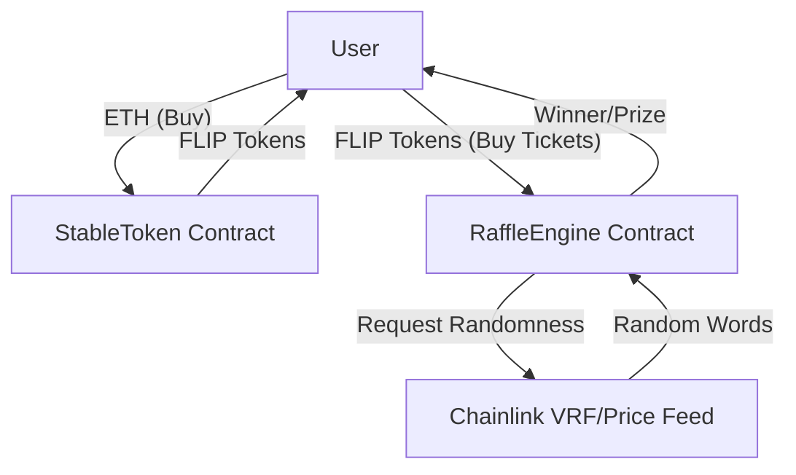

# System Architecture

## Overview
The FortuneFlip system is designed as a decentralized raffle ecosystem centered around a stable-value token. The core components interact to provide a seamless user experience from token acquisition to raffle participation and reward distribution.

## Core Components

### 1. StableToken (ERC20)
-   **Role**: Primary currency for the platform.
-   **Mechanism**:
    -   Pegged to ETH value via Chainlink AggregatorV3Interface.
    -   Implements a buy/sell taxation system (10% buy, 15% sell) to sustain the platform.
    -   Maintains liquidity for user cash-outs.

### 2. RaffileEngine (VRFConsumerBaseV2Plus)
-   **Role**: Manages raffle logic and prize distribution.
-   **Mechanism**:
    -   **Ticket System**: Users exchange StableToken for tickets (fixed rate).
    -   **Raffle Rounds**: Manages state (Open/Closed) and participants.
    -   **Winner Selection**:
        -   Utilizes Chainlink VRF V2.5 for secure, verifiable random number generation.
        -   Implements binary search for efficient winner resolution among ticket holders.
    -   **Prize Pool**: Locks tokens from ticket sales into a prize pool, releasable only to the round winner.

## Interactions



## Data Structures

### Ticket Range
To efficiently track ticket ownership without storing every individual ticket, the system uses a `TicketRange` struct:
```solidity
struct TicketRange {
    uint256 start;
    uint256 end;
    address owner;
}
```
This allows for O(log n) winner lookup complexity using binary search, significantly reducing gas costs compared to linear iteration.

## Security Considerations

-   **Reentrancy**: State changes generally occur before external calls (Checks-Effects-Interactions pattern).
-   **Randomness**: Dependent on Chainlink VRF to prevent manipulation of winner selection.
-   **Access Control**: Critical functions (e.g., `removeLiquidity`) are restricted to the contract owner.